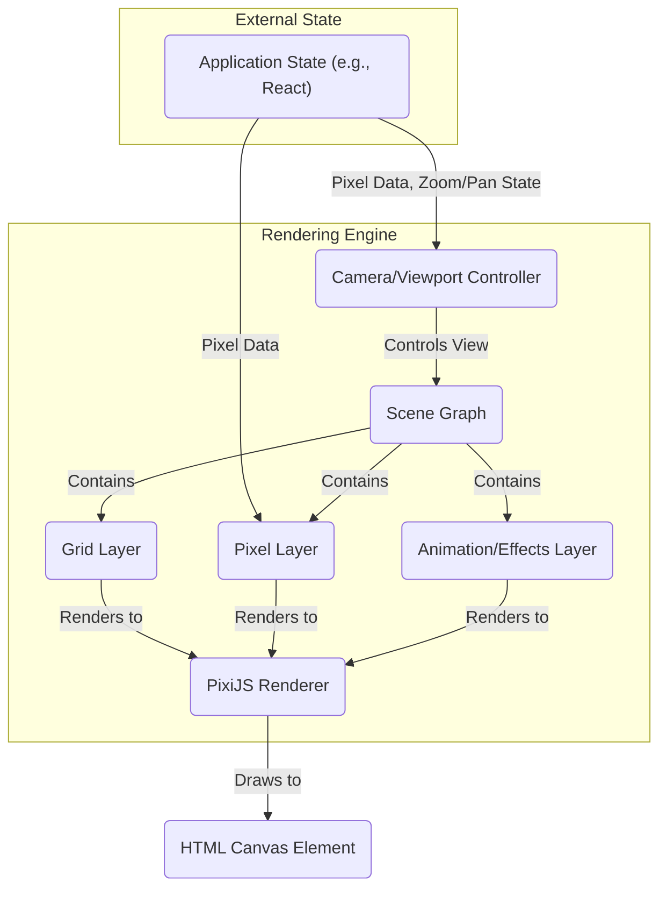
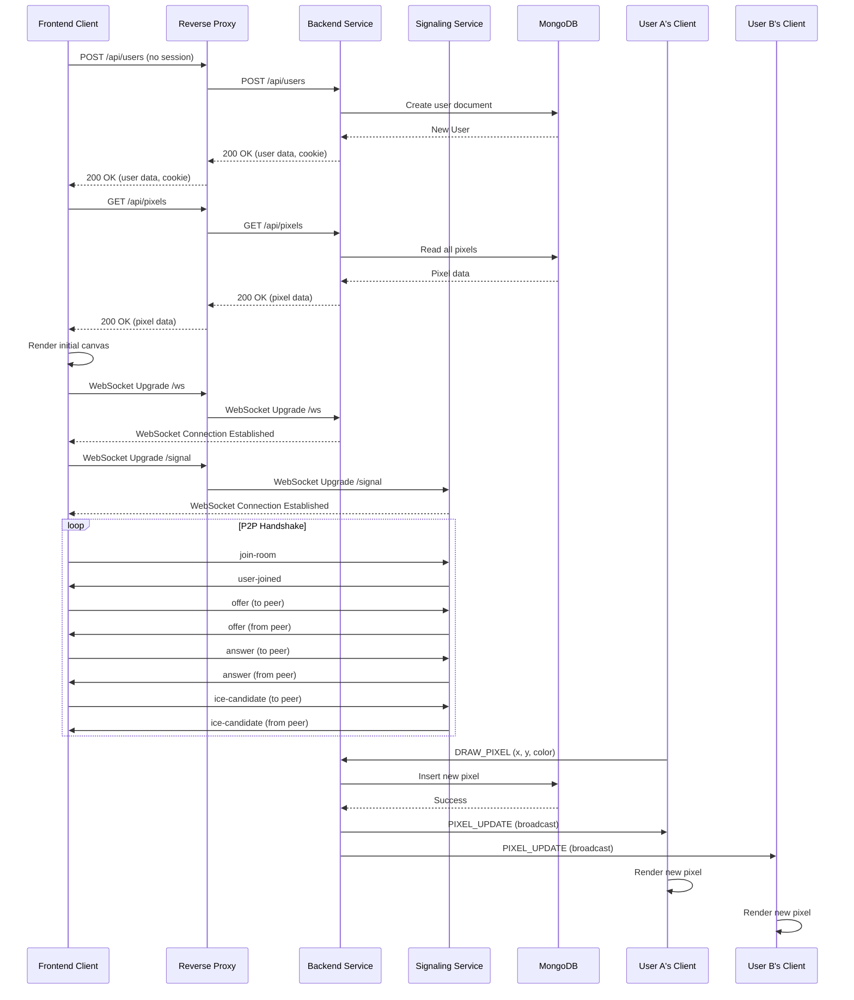
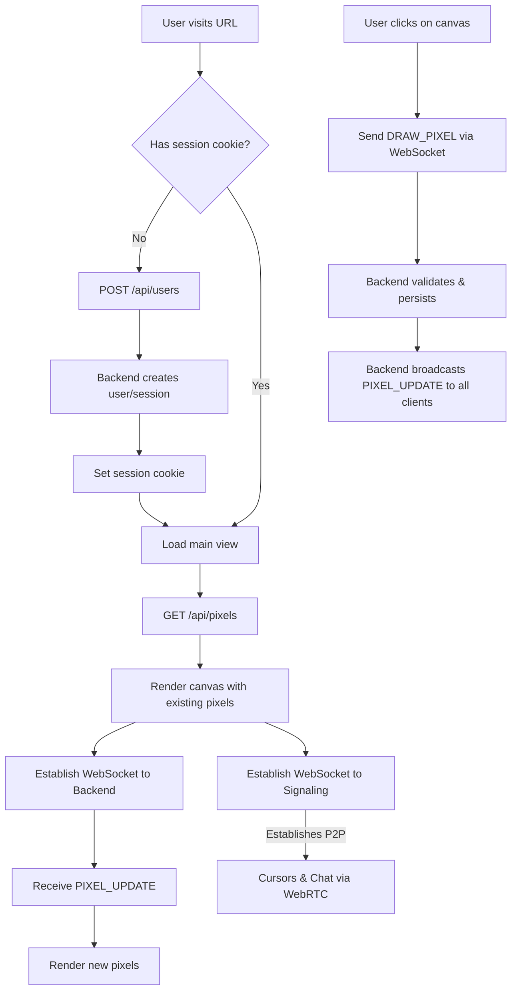

#  Technical Specification

## [TRD-233] System Overview

System Overview
The system is a real-time web application built using a monorepo architecture with a frontend developed in React and TypeScript. It comprises three main, independently deployable services: a Frontend Application, a Backend Service, and a Signaling Service. These services are containerized using Docker and managed by docker\-compose. A Caddy server acts as a reverse proxy, routing traffic to the appropriate service. Data persistence is handled by a self-hosted MongoDB instance. Communication between client and server for core updates relies on WebSockets, while peer-to-peer interactions (cursors, chat) are facilitated by WebRTC.

## [TRD-64] Architectural Goals & Constraints

### [TRD-152] Architectural Goals

[TRD-21] Modularity: The system must be decomposed into well-defined, isolated services (frontend, backend, signaling) that can be developed, tested, and deployed independently.

[TRD-190] Scalability: The backend architecture should be designed for horizontal scalability, with stateless services where possible.

[TRD-201] Testability: The backend must have a comprehensive integration test suite. Individual components and UI effects should have dedicated testing harnesses.

[TRD-228] Developer Experience: The monorepo structure, make targets, and configuration management should provide a convenient development workflow.

### [TRD-100] Technical Constraints

[TRD-222] The entire stack (frontend and backend) must be written in TypeScript.

[TRD-145] The frontend must use React for UI components and PixiJS for canvas rendering.

[TRD-129] The deployment must use Docker containers for each service, orchestrated with docker-compose.

[TRD-144] The database must be a self-hosted MongoDB instance.

[TRD-3] Caddy must be used as the reverse proxy.

[TRD-84] The project must be structured as a monorepo.

### [TRD-75] Architectural Pattern Guidance

The architecture will follow a Service-Oriented Architecture (SOA) pattern. The backend is split into a main Backend Service handling core business logic and state, and a dedicated Signaling Service to manage the WebRTC connection lifecycle. This separation allows for independent scaling and maintenance of concerns.

## [TRD-178] Proposed High-Level Architecture

[TRD-111] Frontend Application (Client): A single-page application built with React, Vite, and PixiJS. It is responsible for all rendering, including the pixel canvas, UI widgets, and animations. It establishes and manages a WebSocket connection to the Backend Service for pixel data and initiates WebRTC connections via the Signaling Service for peer-to-peer communication.

[TRD-217] Backend Service (Node.js): Manages core application logic. It handles user session creation, serves initial canvas state via a REST API, and manages WebSocket connections. It receives pixel draw events from clients, persists them to MongoDB, and broadcasts them to all other connected clients, respecting the rate-limiting rules.

[TRD-55] Signaling Service (Node.js): A dedicated service whose sole responsibility is to facilitate WebRTC peer discovery. It orchestrates the exchange of signaling messages (offers, answers, ICE candidates) between clients to establish direct peer-to-peer connections for cursor sharing and chat.

[TRD-36] MongoDB Database: A single database instance containing two primary collections: users (for user profiles) and pixels (for canvas state). It is accessed by the Backend Service.

[TRD-43] Caddy Reverse Proxy: The single entry point for all external traffic. It routes API requests and WebSocket connections to the Backend Service and signaling traffic to the Signaling Service. It also serves the static frontend application files and handles TLS termination.

## [TRD-183] Technology Stack

### [TRD-42] Monorepo Structure

[TRD-5] /apps: Contains the source code for each independent application (frontend, backend, signaling).

[TRD-80] /libs: Contains shared code, such as TypeScript types and utility functions (common-types, utils), accessible across the monorepo.

[TRD-235] /docker: Contains Dockerfiles for each service and the docker-compose.yaml file.

[TRD-195] Makefile: Root-level makefile for common development tasks (build, test, run).

### [TRD-150] Frontend

[TRD-13] Framework/Library: React, PixiJS

[TRD-236] Language: TypeScript

[TRD-205] Build Tool: Vite (configured with path aliases for clean imports, e.g., @components, @common-types)

[TRD-237] Styling: Tailwind CSS (with dark/light mode configuration)

[TRD-147] Error Tracking: Sentry

### [TRD-158] Backend (Backend & Signaling Services)

[TRD-218] Platform: Node.js

[TRD-103] Language: TypeScript

[TRD-78] Framework: Express.js (for routing and middleware)

[TRD-40] Real-time: ws library for WebSockets, node-webrtc or similar for server-side signaling logic.

[TRD-238] Database ORM/Driver: Mongoose (for MongoDB object modeling)

[TRD-164] Error Tracking: Sentry

### [TRD-108] Database

[TRD-180] Type: NoSQL

[TRD-89] System: MongoDB (self-hosted)

### [TRD-230] Deployment & Infrastructure

[TRD-10] Containerization: Docker

[TRD-96] Orchestration: docker-compose

[TRD-155] Reverse Proxy: Caddy

[TRD-204] The unique-names-generator library will be used for generating random human-readable nicknames.

## [TRD-73] Data Management Strategy

### [TRD-109] Database Schema

A NoSQL approach using MongoDB is mandated.

[TRD-196] users collection: Stores information about each unique visitor.

[TRD-1] pixels collection: Stores a historical log of every pixel drawn on the canvas. To adhere to a last-write-wins strategy, records are append-only; they are never deleted or updated in place.

[TRD-250] The current state of the canvas is a logical view derived by aggregating the pixels collection. For any given coordinate, the pixel with the most recent timestamp is considered the current one.

[TRD-101] Indexes will be automatically created on service startup for critical fields (e.g., user_id in the users collection, coordinates in the pixels collection) to ensure efficient querying.

### [TRD-107] Data Persistence

All pixel data is persistent. User session data is persisted in the database, linked to a client-side cookie. Chat messages are ephemeral and not stored.

### [TRD-38] Caching

Pixel data read from the database should be cached in-memory on the Backend Service to reduce database load for frequent requests, though the primary source of truth remains MongoDB.

### [TRD-229] Data Migration

Not applicable for the initial version.

## [TRD-31] API Design

### [TRD-130] REST API (Backend Service)

[TRD-165] POST /api/users: Creates a new user session if no valid cookie is provided. Returns the new user's details.

Response Body:

```json
{
  "userId": "user-abc-123",
  "nickname": "WittyOtter",
  "color": "#FF5733"
}

```

[TRD-138] GET /api/pixels: Fetches the current state of the entire canvas. Used for initial page load.

Response Body:

```json
{
  "pixels": [
    { "x": 10, "y": 25, "color": "#FFFFFF" },
    { "x": 11, "y": 25, "color": "#000000" }
  ]
}

```

### [TRD-168] WebSocket API (Backend Service)

[TRD-97] Endpoint: ws://&lt;domain&gt;/ws

#### [TRD-189] Client-to-Server Messages

[TRD-48] DRAW_PIXEL: Client sends a pixel placement command.

Payload:

```json
{
  "type": "DRAW_PIXEL",
  "payload": { "x": 0, "y": 0, "color": "#FFFFFF" }
}

```

[TRD-248] KEEPALIVE_PONG: Client responds to a server ping to confirm the connection is active.

Payload:

```json
{
  "type": "KEEPALIVE_PONG"
}


```

#### [TRD-41] Server-to-Client Messages

[TRD-191] PIXEL_UPDATE: Server broadcasts updated pixels.

Payload:

```json
{
  "type": "PIXEL_UPDATE",
  "payload": { "pixels": [{ "x": 0, "y": 0, "color": "#FFFFFF", "userId": "user-abc-123" }] }
}

```

[TRD-213] RELOAD_CANVAS: A signal to instruct the client to re-fetch the entire canvas state via REST API.

Payload:

```json
{
  "type": "RELOAD_CANVAS"
}

```

[TRD-255] KEEPALIVE_PING: Server sends a ping to the client to check for an active connection. The client should respond with a KEEPALIVE_PONG message.

Payload:

```json
{
  "type": "KEEPALIVE_PING"
}


```

### [TRD-123] Signaling API (Signaling Service)

[TRD-26] Communication will happen over WebSockets or a similar real-time channel.

[TRD-17] The API will handle standard WebRTC signaling messages. All messages will be wrapped in a common structure: { &quot;type&quot;: string, &quot;payload&quot;: any }.

[TRD-246] join-room: Client joins a signaling room.

Payload:

```json
{
  "type": "join-room",
  "payload": { "roomId": "default" }
}

```

[TRD-242] leave-room: Client leaves a signaling room.

Payload:

```json
{
  "type": "leave-room"
}

```

[TRD-241] offer: Client sends a WebRTC offer to a peer.

Payload:

```json
{
  "type": "offer",
  "payload": { "targetUserId": "string", "sdp": "..." }
}

```

[TRD-245] answer: Client sends a WebRTC answer to a peer.

Payload:

```json
{
  "type": "answer",
  "payload": { "targetUserId": "string", "sdp": "..." }
}

```

[TRD-247] ice-candidate: Client sends an ICE candidate to a peer.

Payload:

```json
{
  "type": "ice-candidate",
  "payload": { "targetUserId": "string", "candidate": "..." }
}

```

[TRD-117] The payload structures for all API and WebSocket messages are defined in the respective API sections. These types will be centralized in the /libs/common-types package for sharing between frontend and backend services.

## [TRD-37] Security Considerations

[TRD-127] All client-server communication will be secured via TLS, terminated at the Caddy reverse proxy.

[TRD-227] User input for chat is not sanitized as it's peer-to-peer and ephemeral. This is an accepted risk for the initial implementation.

[TRD-184] No spam or bot prevention is in scope for the initial version.

[TRD-215] Basic input validation will be implemented on all API endpoints and WebSocket messages. This includes checking for the presence of required fields (e.g., x, y, color) and validating their basic types (e.g., number, string) to prevent malformed data from corrupting the system state.

[TRD-16] A formal security review for client-side vulnerabilities in the peer-to-peer WebRTC implementation is considered out of scope for the initial version. The focus will be on ensuring functional correctness.

## [TRD-142] Scalability & Performance

[TRD-60] The backend and signaling services are designed to be stateless to allow for simple horizontal scaling by running multiple container instances behind the reverse proxy.

[TRD-81] WebSocket connections require state (session info), which can be managed with an in-memory store for a single-node setup or externalized to a service like Redis if scaling beyond one instance is needed.

[TRD-137] The WebSocket broadcast logic includes rate limiting and batching to prevent client-side flooding and reduce network overhead during high activity periods.

[TRD-2] The frontend will use PixiJS with shaders for rendering to achieve the 60 FPS target, offloading rendering work to the GPU.

[TRD-90] Particle effects for pixel animations will be generated procedurally on the client at startup and managed in memory to avoid static asset loading during interaction.

## [TRD-74] Deployment & Operations

### [TRD-33] CI/CD

Not specified, but the 

Makefile

 will provide hooks for building and testing that can be integrated into a CI/CD pipeline.

### [TRD-221] Makefile Targets

[TRD-79] make build: Builds all Docker images.

[TRD-12] make up: Starts all services using docker-compose.

[TRD-141] make down: Stops all services.

[TRD-86] make test-backend: Runs the backend integration test suite.

[TRD-274] make test-backend-watch: Runs the backend test suite in watch mode, automatically re-running tests on file changes for faster feedback during development.

[TRD-66] make dev-frontend: Launches the frontend in local development mode with hot-reloading.

[TRD-148] make dev-backend: Launches the backend in local development mode.

### [TRD-161] Configuration

[TRD-244] Application configuration (e.g., database connection strings, API domains, debug flags) will be managed through environment variables, following 12-factor app principles. A configuration layer in both frontend and backend will load these variables.

[TRD-243] Application-level tunable parameters (e.g., animation timings, connection status thresholds, rate-limiting frequency) will be centralized in dedicated configuration files within the respective services (frontend, backend) to allow for easy tweaking during development and deployment.

### [TRD-154] Monitoring & Logging

[TRD-98] Standard output from containers will be used for logging.

[TRD-44] Sentry will be integrated into both the frontend and backend for automated error tracking and reporting.

[TRD-254] For production environments, all critical transactions must be logged to the console (standard output). This includes incoming API requests, WebSocket connection events and messages, and database write operations, to ensure traceability.

## [TRD-271] Testing Strategy

### [TRD-261] Guiding Philosophy

The testing plan is designed to support a layer-by-layer validation approach, which is conducive to AI-assisted development. Each stage provides a stable, verifiable checkpoint before proceeding to the next level of complexity, ensuring continuous feedback and early detection of issues.

### [TRD-260] Backend Automatic Testing

Backend Automatic Testing
The backend will be tested via a comprehensive integration test suite, executed with make test-backend. This suite will validate the entire backend stack, including API endpoints, WebSocket message handling, and database interactions. Tests will programmatically simulate multiple clients to verify state consistency under concurrent operations, specifically covering:\n- User session creation and validation via REST API.\n- Fetching initial canvas state.\n- State Management Validation: Handling concurrent DRAW_PIXEL events from multiple simulated clients, ensuring the last-write-wins logic is correctly applied and the database state remains consistent.\n- WebSocket Notification Validation: Verifying that all connected clients receive the correct PIXEL_UPDATE broadcasts, and that updates are correctly batched and rate-limited under high load.

### [TRD-270] Frontend Manual & Staged Testing Plan

The frontend will be validated through a staged manual testing plan designed for incremental review and validation. This approach ensures each layer of functionality is stable before building upon it.

#### [TRD-268] Stage 1: Rendering Engine Derisking

Verify core PixiJS functionality in isolation. Confirm smooth zooming and panning performance on a large canvas. Render a large grid of mock, hard-coded pixels to test rendering efficiency. Test the Level-of-Detail logic for grid lines at various zoom levels.

#### [TRD-267] Stage 2: User Input and Drawing

Connect user mouse/touch events to drawing actions. A click on the canvas should create a new pixel graphic within the PixiJS scene. Verify that canvas coordinates are correctly mapped to pixel grid coordinates.

#### [TRD-262] Stage 3: Network Integration

Connect drawing actions to the WebSocket client. A local pixel placement should trigger a DRAW_PIXEL message to the backend. The client must listen for incoming PIXEL_UPDATE messages and update the PixiJS scene accordingly. This can be tested initially with mock server responses before integrating with the live backend.

#### [TRD-273] Stage 4: UI Widgets and State

Test the functionality of all UI widgets. For the Connection Viability Widget, manually disconnect the WebSocket and verify that the UI reflects the connection status and that the reconnect button functions as expected. Verify the Color Palette correctly sets the drawing color.

## [TRD-63] Detailed Functional Requirements

### [TRD-110] Frontend Application

#### [TRD-112] Canvas Rendering (PixiJS)

[TRD-88] Initialize a PixiJS application to render the 5000x5000 pixel canvas.

[TRD-45] Implement smooth zooming and panning logic.

[TRD-115] The grid visibility will be togglable by the user. When visible, gridlines will be rendered for each pixel at high zoom levels. To provide scale context, gridlines at 10, 100, and 1000 pixel intervals will be rendered with progressively darker shades. The rendering of all grid levels will be managed via heuristics based on the current zoom level and viewport size to ensure clarity and avoid visual clutter.

[TRD-210] Render pixels as individual graphics objects.

##### [TRD-265] User Cursor Rendering

User cursors received via WebRTC will be rendered as separate, temporary graphics objects on a dedicated layer within the PixiJS scene, above the pixel layer but below the UI. Each cursor graphic will be associated with a user's ID and will be updated in real-time based on incoming WebRTC messages. The graphic will display the user's nickname and will be tinted with the user's assigned color to ensure clear identification. To optimize performance, cursor objects will be pooled and reused.

##### [TRD-6] Animation Engine

[TRD-216] On startup, procedurally generate 10 variations of a "dust" particle effect sprite sheet using shaders and store them in memory.

[TRD-65] When a pixel appears, play one of the 10 animations in rotation at the pixel's location. The animation should last 0.5 seconds.

##### [TRD-258] Rendering Engine Component Diagram



#### [TRD-272] PixiJS Scene Lifecycle & State Management

##### [TRD-266] State Synchronization

A clear boundary will be maintained between React's application state and PixiJS's rendering state. React will serve as the single source of truth for data (like the pixel map, user list, etc.). A dedicated synchronization mechanism will be implemented, using React effects (useEffect) to translate changes in React state into imperative calls to the PixiJS rendering engine. This one-way data flow (React -> PixiJS) prevents inconsistencies.

##### [TRD-263] Initial Load

On initial load, after fetching pixel data via the REST API, the data is stored in the React state. An effect then triggers a bulk-add operation in the PixiJS engine, creating all the initial pixel graphics in a single, optimized step.

##### [TRD-264] Real-time Updates

When the WebSocket client receives a PIXEL_UPDATE, it will update the React state. Another effect, observing this part of the state, will then command the PixiJS engine to add, update, or animate the specific pixels that have changed. Batching updates to the rendering engine within a single requestAnimationFrame callback will be used to ensure smooth performance.

##### [TRD-269] Object Management & Pooling

To avoid performance degradation from frequent creation and destruction of graphics objects (especially for animations and cursors), an object pooling pattern will be implemented. Pre-created graphic objects will be kept in a pool, activated and positioned when needed, and returned to the pool when their task is complete (e.g., an animation finishes).

#### [TRD-256] Pixel Interaction

[TRD-251] When a user clicks on an existing pixel on the canvas, they should be able to change its color. This action effectively creates a new pixel at the same coordinates with the new color, following the last-write-wins principle.

#### [TRD-126] State Management

[TRD-121] Use React hooks (e.g., useState, useContext) or a small state management library to manage UI state (widget visibility, theme, etc.).

#### [TRD-186] Connectivity Module

##### [TRD-39] WebSocket Client

[TRD-170] Connect to the Backend Service. Listen for PIXEL_UPDATE and RELOAD_CANVAS messages. Send DRAW_PIXEL messages on user input.

##### [TRD-134] WebRTC Client

[TRD-225] Connect to the Signaling Service to establish peer connections. Manage data channels with specific properties: chat messages must use a reliable and ordered data channel to guarantee delivery. Cursor positions will use an unreliable and unordered data channel to prioritize low latency over guaranteed delivery.

##### [TRD-46] Connection Viability Widget

[TRD-207] Monitor the state of WebSocket and WebRTC connections. The widget will display visual feedback (color-coded icons) based on connection health and will show the time elapsed since the last successful server keepalive signal was received. It must also include a prominent reconnect button when a connection is lost.

#### [TRD-223] UI Components (React)

[TRD-182] Develop all UI widgets as modular, reusable React components (ChatWidget, UserListWidget, DebugPanel, etc.).

[TRD-249] A ColorPaletteWidget component will provide users with a selection of colors to use for drawing.

[TRD-174] Implement foldable/collapsible behavior for widgets.

[TRD-132] Use Tailwind CSS for styling, with a centralized configuration for easy theming (dark/light).

#### [TRD-104] Debug Module

[TRD-219] A dedicated React component, the Debug Panel, will be rendered conditionally based on an environment variable.

[TRD-59] This panel will provide UI controls to regenerate the particle animation effects in real-time, allowing for easy tweaking.

### [TRD-149] Backend Service

#### [TRD-15] User/Session Controller

[TRD-19] An endpoint to handle new user creation. It will generate a unique ID, call a utility to generate a random nickname, assign a color, store this in the users collection, and return the user object.

#### [TRD-50] Pixel Controller

[TRD-192] An endpoint to serve the initial full state of the canvas from the pixels collection.

#### [TRD-181] WebSocket Service

[TRD-143] On connection, associate the WebSocket session with a user_id.

[TRD-252] The service will implement a keepalive mechanism. It will periodically send a PING message to clients and expect a PONG response. The absence of a response within a configured timeout will be used to prune dead connections.

[TRD-136] On receiving a DRAW_PIXEL message:

[TRD-57] Validate the input.

[TRD-208] Check for conflicts based on timestamp (last-write-wins).

[TRD-34] Persist the new pixel to the pixels collection.

[TRD-76] Add the update to a queue.

[TRD-194] A separate process (e.g., using setInterval) runs at 10Hz. In each tick, it checks the queue. If there are updates, it batches them into a single PIXEL_UPDATE message and broadcasts it to all connected clients.

### [TRD-18] Signaling Service

#### [TRD-135] WebSocket Handler

[TRD-94] Manage "rooms" or sessions for signaling.

[TRD-140] On a join-room message, add the user to the session.

[TRD-156] Relay WebRTC signaling messages (offer, answer, ice-candidate) to the appropriate peers within the session.

[TRD-67] Handle leave-room messages to clean up sessions.

## [TRD-157] Non-Functional Requirements

### [TRD-4] Performance

[TRD-106] Canvas FPS: The frontend application must maintain an average of 60 FPS during typical use (panning, zooming, moderate pixel updates). Verified through browser developer tools (performance profiler).

[TRD-53] WebSocket Latency: Time from a user sending a DRAW_PIXEL event to another client rendering that pixel must be < 200ms under low-to-moderate load (<10 updates/sec). Verified through integration tests that measure round-trip time.

[TRD-240] WebRTC Latency: Latency for peer-to-peer data channels should be managed according to their purpose. Cursor updates, sent over an unreliable channel, must prioritize low latency. Chat messages, sent over a reliable channel, prioritize guaranteed delivery. The system should achieve this using direct peer connections facilitated by the signaling server, without additional latency-optimization infrastructure.

### [TRD-224] Reliability

[TRD-99] The client application must automatically attempt to re-establish a lost WebSocket connection, triggered when a server keepalive signal has not been received for 2 seconds.

[TRD-116] The reconnect button in the viability widget must successfully re-initialize both WebSocket and WebRTC connections. Verified through manual testing.

### [TRD-82] Testability

[TRD-22] The backend will have an integration test suite (make test-backend). This suite will use a client library (e.g., ws client) to simulate multiple users connecting, drawing pixels simultaneously, and disconnecting. It will assert that all clients receive the correct, consistent state updates.

[TRD-71] The frontend will have a manual testing plan to verify all UI interactions, widget behaviors, and visual effects across major browsers (Chrome, Firefox, Safari).

## [TRD-56] Implementation Plan & Phasing

### [TRD-93] Phase 1: MVP (Minimum Viable Product)

Goal: Deliver the core end-to-end functionality of drawing and viewing pixels in real-time.

#### [TRD-69] Scope

[TRD-214] User Story: "As a new visitor, I want to be automatically assigned a unique, random username and session..."

[TRD-7] User Story: "As a user, I want to click on a grid cell to place a pixel..."

[TRD-234] User Story: "As a user, I want my placed pixels to be saved permanently..."

[TRD-77] User Story: "As a user, I want to see pixels drawn by other users appear on my screen in real-time..."

#### [TRD-212] Milestones

[TRD-52] Backend & Database Setup:

[TRD-119] Set up monorepo, Docker, and docker-compose for backend and MongoDB.

[TRD-120] Implement user and pixel data models (Mongoose schemas).

[TRD-118] Create the REST endpoint for creating a user.

[TRD-68] Create the REST endpoint for fetching the initial canvas state.

[TRD-8] Real-time Backend Logic:

[TRD-193] Implement the WebSocket service for handling connections.

[TRD-211] Implement the DRAW_PIXEL logic: persist to DB and broadcast via PIXEL_UPDATE (without rate limiting initially).

[TRD-62] Develop the backend integration test suite.

[TRD-58] Core Frontend Canvas:

[TRD-11] Set up the frontend with React, TypeScript, Vite, and PixiJS.

[TRD-83] Render the basic grid canvas.

[TRD-20] Implement WebSocket client to connect to the backend and receive PIXEL_UPDATE messages.

[TRD-188] Implement click handler to send DRAW_PIXEL messages.

[TRD-197] Session & State Sync:

[TRD-30] Implement client-side session handling (cookies).

[TRD-166] Implement initial canvas load from the REST API.

[TRD-169] Add WebSocket rate-limiting and batching on the backend.

### [TRD-72] Phase 2 onwards (Future Enhancements)

#### [TRD-9] Scope

[TRD-159] WebRTC Integration:

[TRD-153] Implement the Signaling Service.

[TRD-24] Integrate WebRTC on the frontend for real-time cursor sharing.

[TRD-27] Integrate WebRTC for the ephemeral group chat.

[TRD-177] UI Widgets & Effects:

[TRD-185] Develop the Chat, Active Users, and Connection Viability widgets.

[TRD-92] Implement the procedural "dust" animation with PixiJS shaders.

[TRD-85] Implement sound effects using the Web Audio API.

[TRD-70] Advanced Canvas Features:

[TRD-175] Implement smooth zoom/pan.

[TRD-32] Implement dynamic grid rendering based on zoom level.

#### [TRD-28] Final Polish (Post-Core Features)

[TRD-187] Implement the dark/light theme switcher.

[TRD-198] Integrate Sentry for error tracking.

[TRD-160] Develop the frontend debug panel for animations.

## [TRD-171] Components Diagram

Components Diagram
```mermaid
graph TD
    subgraph "Browser (Client)"
        direction LR
        subgraph "Frontend Application"
            UI(UI Components - React)
            State(State Management)
            Conn(Connectivity Module)
            Render(Rendering Engine - PixiJS)
        end
    end

    subgraph "Server Infrastructure"
        direction LR
        Caddy(Caddy Reverse Proxy)
        
        subgraph "Backend Service"
            direction TD
            UserCtrl(User/Session Controller)
            PixelCtrl(Pixel Controller)
            WSService(WebSocket Service)
        end

        Signaling(Signaling Service)
        MongoDB(MongoDB Database)
    end

    note right of Caddy: Caddy acts as the single entry point, handling TLS and routing traffic.

    UI -- "User Actions" --> State
    State -- "Updates" --> Render
    Conn -- "Updates State" --> State

    Conn -- "REST API (User/Pixels)" --> Caddy
    Conn -- "Pixel Updates (WebSocket)" --> Caddy
    Conn -- "P2P Signaling (WebSocket)" --> Caddy

    Caddy -- "/api/users" --> UserCtrl
    Caddy -- "/api/pixels" --> PixelCtrl
    Caddy -- "/ws" --> WSService
    Caddy -- "Signaling traffic" --> Signaling

    WSService -- "Reads/Writes" --> MongoDB
    PixelCtrl -- "Reads" --> MongoDB
    UserCtrl -- "Reads/Writes" --> MongoDB

```

## [TRD-259] Detailed Interaction Sequence Diagram



## [TRD-105] User Experience Flow Diagram

User Experience Flow Diagram


## [TRD-200] Entity Relationship Diagram (ERD)

Entity Relationship Diagram (ERD)
The database contains two collections: users and pixels. The pixels collection functions as an append-only log, recording every pixel placement to preserve history. The current canvas state is dynamically aggregated from this log based on the latest timestamp for each coordinate. The collection will be indexed on (x_coord, y_coord) and timestamp for efficient lookups.

```mermaid
erDiagram
    users {
        string userId PK "User's unique identifier"
        string nickname "Randomly generated nickname"
        string color "Assigned hex color code"
    }

    pixels {
        int x_coord PK
        int y_coord PK
        string color "Hex color code of the pixel"
        datetime timestamp "Timestamp of creation/update"
        string userId FK "Reference to the user who placed the pixel"
    }

    users ||--o{ pixels : "places" }


```

## [TRD-163] User Interface Key Requirements

### [TRD-167] General Look & Feel

[TRD-146] The design should be clean and modern, built with Tailwind CSS.

[TRD-35] The Pixel Canvas is the permanent background layer of the application.

[TRD-199] All other UI elements (Chat, User List, Connection Status) are "flying" widgets that overlay the canvas.

[TRD-232] Each widget must be foldable/collapsible to an icon or small tab, and expandable on click, to maximize canvas visibility.

[TRD-54] The application must support a dark and light theme. A theme toggle button should be present in a main header or settings area.

[TRD-231] All interactions, especially canvas zooming and panning, must be smooth and responsive, targeting 60 FPS.

[TRD-226] The layout must be responsive and usable on both desktop and mobile devices.

[TRD-128] The primary accent color for the UI will be Emerald 600 from the Tailwind CSS color palette. Further style guide details (typography, icon styles) will be decided during implementation.

### [TRD-179] Key Screens / Views (based on UX Flow)

#### [TRD-202] Main Canvas View

[TRD-14] This is the default view upon entering the application.

[TRD-176] It displays the 5000x5000 pixel grid. The grid lines should become more or less detailed based on the zoom level (Level of Detail).

[TRD-113] It renders all persisted pixels fetched from the backend.

[TRD-131] It displays the real-time cursors of other connected users.

[TRD-61] It contains the floating UI widgets, which can be in a folded or unfolded state.

#### [TRD-151] Floating Widgets

##### [TRD-257] Color Palette Widget

[TRD-253] A widget that displays a palette of selectable colors. When a color is chosen, it becomes the active color for any subsequent pixel placements. This widget should be collapsible.

##### [TRD-91] Chat Widget

[TRD-124] When unfolded, it shows a scrollable history of ephemeral chat messages from the current session.

[TRD-47] It includes a text input field and a send button.

[TRD-102] When folded, it may show a small icon with a notification badge for unread messages.

[TRD-172] Links to UX Flow: OpenChat, SendChatMessage.

##### [TRD-162] Active Users Widget

[TRD-114] When unfolded, it displays a list of currently connected users.

[TRD-209] Each list item should show the user's avatar (generated from nickname initials with their assigned color) and their full nickname.

[TRD-95] It must display a "Total Users Online: [count]" metric.

[TRD-51] Links to UX Flow: OpenUserList.

##### [TRD-220] Connection Status Widget

[TRD-25] Always visible in a corner of the screen.

[TRD-133] Displays a simple, color-coded icon to represent connection quality.

[TRD-206] Green: All connections (WebSocket, WebRTC) are healthy.

[TRD-125] Yellow/Orange: Experiencing latency or intermittent issues.

[TRD-139] Red: A connection has been lost.

[TRD-23] Includes a "Reconnect" or "Refresh" button that becomes prominent when the status is Red.

[TRD-49] Links to UX Flow: ShowConnectionError, ClickReconnect.

[TRD-122] The connection status will be determined by a WebSocket keepalive mechanism. If the client does not receive a keepalive signal from the server for more than 2 seconds, the status will turn to Red, and an automatic reconnection attempt will be initiated.

##### [TRD-29] Debug Panel (Development Mode Only)

[TRD-203] A floating panel that is only visible when the app is run in a debug/development mode (controlled by an environment variable).

[TRD-239] Contains controls to tweak animation parameters (e.g., particle emission rate, lifetime).

[TRD-87] Includes a button to trigger the regeneration of the client-side particle effect shaders, allowing for real-time visual feedback during development.
