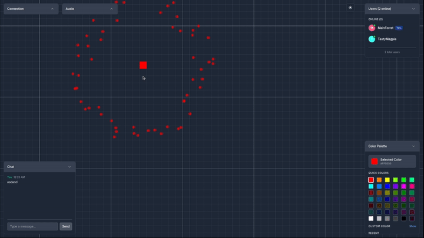
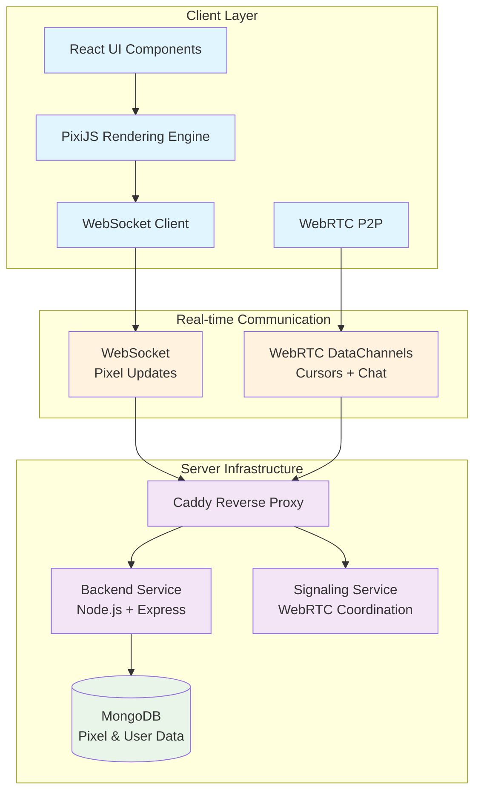

# 🎨 Collaborative Pixel Canvas

A web app where anyone can draw pixels on a shared canvas in real-time. Other people see your pixels appear instantly, you can see their cursors moving around, and there's a chat to talk while drawing. No signup required—just visit and start drawing.

**[🚀 Live Demo](https://pixall.art)** | **Built with [Nautex AI](https://nautex.ai) by [Ivan Makarov](https://x.com/ivan_mkrv)**

## ✨ Demo



## 🎯 What Is This?

It's like a shared whiteboard but with pixels. You can:

- Draw pixels one at a time (click to place)
- See other people drawing at the same time
- Watch their cursors move around
- Chat with everyone currently online
- Zoom and pan around a 5000x5000 pixel canvas
- Join anonymously - you get a random username

Built to explore real-time web tech (WebRTC for cursors/chat, WebSockets for pixel updates) and test if AI can build complex apps from specifications alone.

## 🏗️ Architecture & Tech Stack

### High-Level System Design



### Technology Stack

**Frontend**
- **React** + **TypeScript** - Component-based UI architecture
- **PixiJS** - High-performance WebGL canvas rendering
- **Vite** - Fast development and build tooling
- **Tailwind CSS** - Utility-first styling with dark/light themes

**Backend**
- **Node.js** + **Express** - RESTful API and WebSocket server
- **MongoDB** - Document database with append-only pixel history
- **WebSocket (ws)** - Real-time pixel broadcast with rate limiting
- **Mongoose** - MongoDB object modeling

**Infrastructure**
- **Docker** + **docker-compose** - Containerized service orchestration
- **Caddy** - Reverse proxy with automatic HTTPS
- **WebRTC** - Peer-to-peer data channels for cursors and chat
- **Sentry** - Error tracking and monitoring

## 🛠️ How It's Made

This app was built by AI from start to finish. Here's how it worked: 

1. **Talked to Nautex AI chatbot** about what I wanted to build
   - It asked questions and gathered requirements
   - **Result**: Initial specs for the app

2. **Refined the specifications** in the Nautex app
   - Fixed gaps and added missing details
   - **Result**: Complete PRD and TRD documents

3. **Planned the file structure** before any coding
   - Mapped every file to specific requirements
   - **Result**: Complete codebase blueprint

4. **Created coding tasks** broken into small chunks
   - Each task linked to specific files and requirements
   - **Result**: Step-by-step implementation plan

5. **Exported everything** and connected to Claude Code
   - Used [Nautex MCP](https://github.com/hmldns/nautex) for real-time sync
   - **Delivered to Claude**: 
     - [PRD.md](.nautex/docs/PRD.md) - What to build
     - [TRD.md](.nautex/docs/TRD.md) - How to build it
     - [FILE.md](.nautex/docs/FILE.md) - Where to put code
     - Live task updates

6. **Claude Code wrote all the code**
   - Followed the specifications exactly
   - No architectural decisions needed - everything was pre-planned
   - **Result**: Working app that matches the specs

What this approach gave us:
- App built exactly as specified - no surprises
- Tests included from the start
- Clean monorepo structure with shared types
- Smooth 60 FPS rendering with WebGL optimization

### 🏭 Technical Decisions (Made by AI)

**Two-channel approach**: WebSockets for pixels (needs to be reliable), WebRTC for cursors/chat (needs to be fast)

**Append-only pixels**: Never delete pixel history, just track the latest one for each position

**GPU rendering**: PixiJS handles thousands of pixels smoothly, grid detail changes based on zoom level

**No signup**: Cookie-based sessions with random usernames - zero friction to start drawing

## 🚀 Quick Start

```bash
# Clone the repository
git clone <repository-url>
cd pix-canvas

# Start all services with Docker
make up

# Or run in development mode
make dev-frontend  # Terminal 1
make dev-backend   # Terminal 2
```

The application will be available at `http://localhost:3000`

## 🧪 Testing

```bash
# Run backend integration tests
make test-backend

# Run with watch mode for development
make test-backend-watch
```

## 🎨 Features

- 5000x5000 pixel canvas with smooth zoom/pan
- See other people's pixels appear in <200ms
- Peer-to-peer chat (not stored on server)
- Live cursors showing where others are pointing
- Particle effects when pixels are placed
- Auto-reconnect if connection drops
- Works on mobile
- Dark/light theme toggle
- Debug panel for tweaking animations (dev mode)

---
