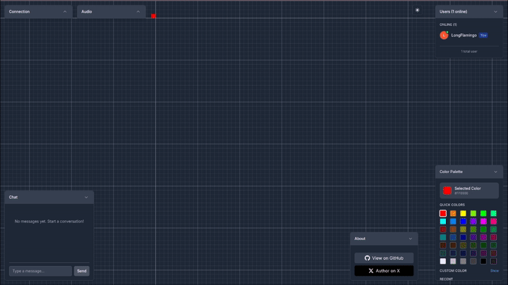

# 🎨 Collaborative Pixel Canvas

A real-time collaborative digital art space where anonymous visitors can draw pixels together on a shared canvas. This project serves as a comprehensive technological demonstrator, showcasing both cutting-edge web technologies (WebRTC, WebSockets, high-performance canvas rendering) and the emerging paradigm of AI-driven development—where complete applications are systematically compiled from detailed specifications using coding agents.

**[🚀 Live Demo](https://pixall.art)** | **Built with [Nautex AI](https://nautex.ai) by [Ivan Makarov](https://x.com/ivan_mkrv)**

## ✨ Demo



## 🎯 What Is This?

Infinite Pixel Canvas is a browser-based collaborative art platform where users can:

- **Draw Together**: Place pixels in real-time with other anonymous users
- **See Live Presence**: Watch other users' cursors move across the canvas
- **Chat & Connect**: Communicate via peer-to-peer chat while creating
- **Explore Canvas**: Navigate a 5000x5000 pixel grid with smooth zoom/pan
- **Join Instantly**: No registration required - jump in and start creating

The project serves as both an engaging creative platform and a comprehensive demonstration of modern web technologies working in harmony.

## 🏗️ Architecture & Tech Stack

### High-Level System Design


### Technology Stack

**Frontend**
- **React** + **TypeScript** - Component-based UI architecture
- **PixiJS** - High-performance WebGL canvas rendering
- **Vite** - Fast development and build tooling
- **Tailwind CSS** - Utility-first styling with dark/light themes

**Backend**
- **Node.js** + **Express** - RESTful API and WebSocket server
- **MongoDB** - Document database with append-only pixel history
- **WebSocket (ws)** - Real-time pixel broadcast with rate limiting
- **Mongoose** - MongoDB object modeling

**Infrastructure**
- **Docker** + **docker-compose** - Containerized service orchestration
- **Caddy** - Reverse proxy with automatic HTTPS
- **WebRTC** - Peer-to-peer data channels for cursors and chat
- **Sentry** - Error tracking and monitoring

## 🛠️ How It's Made

This project demonstrates the complete **specification-to-code** development paradigm using **[Nautex AI](https://github.com/hmldns/nautex)** acting as Architect, Technical Product Manager, and Project Manager for **Claude Code**. 

### Development Flow & Artifacts

#### 🎯 1. Requirements Gathering
- Interactive briefing session with Nautex AI chatbot
- Comprehensive exploration of project vision, gathering questions and ideas
- **→ Produces**: Initial product and technical specifications

#### 📝 2. Specification Refinement  
- Iterative refinement process within Nautex app
- Filling details and resolving TODOs flagged during analysis
- **→ Produces**: Finalized PRD and TRD documents

#### 🗂️ 3. Codebase Architecture Planning
- Pre-planned file organization mapped to specific requirements
- Every file location determined before coding begins
- **→ Produces**: Complete FILE structure document

#### 📋 4. Task Planning & Decomposition
- Granular coding, testing, and review tasks planned in structured layers
- Reviews scheduled early to verify alignment and demonstrate incremental progress
- **→ Produces**: Executable task plan with file/requirement references

#### 📥 5. Export & Synchronization
- All artifacts (PRD, TRD, FILE) exported from Nautex app
- **[Nautex MCP](https://github.com/hmldns/nautex)** enables synchronization
- **→ Delivers**: 
  - **[PRD.md](.nautex/docs/PRD.md)** - Product requirements document
  - **[TRD.md](.nautex/docs/TRD.md)** - Technical requirements document
  - **[FILE.md](.nautex/docs/FILE.md)** - File structure mapping
  - Live task stream via MCP to coding agent

#### 🤖 6. Systematic Code Execution
- **Claude Code** receives synchronized specifications and tasks
- Implements each task following pre-defined guidance
- Zero architectural decisions required—all planning completed upfront
- **→ Produces**: Complete, specification-aligned codebase

This approach ensured:
- **Predictable Outcomes**: Complete application built exactly to specification
- **Quality Assurance**: Comprehensive testing strategy with integration tests
- **Consistent Architecture**: Monorepo structure with shared types and utilities  
- **Performance Focus**: 60 FPS rendering target with optimized WebGL and object pooling

### 🏭 Key Engineering Decisions

**Real-time Architecture**: Hybrid approach using WebSockets for reliable pixel state synchronization and WebRTC data channels for low-latency cursor movements and ephemeral chat.

**Scalable Data Model**: Append-only pixel storage with last-write-wins semantics, enabling horizontal scaling and maintaining complete drawing history.

**Performance Optimization**: PixiJS with GPU-accelerated rendering, procedural particle effects, and intelligent Level-of-Detail grid rendering based on zoom level.

**Anonymous User Experience**: Cookie-based sessions with auto-generated usernames, eliminating friction while maintaining persistent contributions.

## 🚀 Quick Start

```bash
# Clone the repository
git clone <repository-url>
cd pix-canvas

# Start all services with Docker
make up

# Or run in development mode
make dev-frontend  # Terminal 1
make dev-backend   # Terminal 2
```

The application will be available at `http://localhost:3000`

## 🧪 Testing

```bash
# Run backend integration tests
make test-backend

# Run with watch mode for development
make test-backend-watch
```

## 🎨 Features in Detail

- **Large Canvas**: 5000x5000 pixel grid with smooth zoom and pan
- **Real-time Collaboration**: See other users drawing live with sub-200ms latency
- **Peer-to-Peer Chat**: Direct communication without server storage
- **Live Cursors**: WebRTC-powered cursor sharing with user identification
- **Visual Feedback**: Particle effects and audio cues for drawing actions
- **Connection Resilience**: Automatic reconnection with manual fallback
- **Mobile Responsive**: Optimized for both desktop and mobile devices
- **Dark/Light Themes**: Toggle between interface modes
- **Debug Tools**: Development panel for tweaking animations and effects

---
